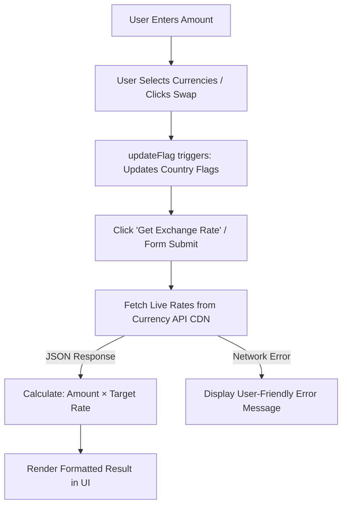

# 💱 Currency Converter

<div align="center">


**A sleek, modern, web-based currency converter featuring real-time exchange rates, dynamic country flags, and a premium glassmorphic interface.**

[Features](#-features) • [Live Demo](#-live-demo) • [Getting Started](#-getting-started) • [Architecture](#-architecture) • [API Reference](#-api-reference)

</div>

---

## 🌟 Overview

**Currency Converter** is a lightweight, high-performance web application that delivers instant, accurate currency conversions across 150+ global currencies. Built with pure Vanilla JavaScript, modern HTML5, and responsive CSS with a modern frosted glass aesthetic, it offers real-time exchange rates without requiring API keys or heavy dependencies.

---

## ✨ Features

- ⚡ **Real-Time Exchange Rates** — Fetches live rates directly from CDN-backed currency endpoints for maximum reliability and speed.
- 🌍 **150+ Currencies Supported** — Preloaded with global ISO-4217 currency codes covering world economies.
- 🏳️ **Dynamic Country Flags** — Automatically renders high-quality country flags matching selected currencies via FlagsAPI.
- 🔄 **One-Click Currency Swap** — Instant 180° animated currency swap with full keyboard accessibility (`Enter` / `Space`).
- 🎨 **Modern Glassmorphism UI** — Contemporary frosted glass container, vibrant indigo-to-purple gradients, ambient backdrop glow, and interactive micro-animations.
- 📱 **Fully Responsive Design** — Fluid layout tailored for seamless experiences across mobile, tablet, and desktop viewports.
- ♿ **Accessible & Intuitive** — Clean semantic markup, ARIA roles, labeled inputs, and focus indicators.
- 🛡️ **Zero Dependencies** — Built completely with vanilla web standards (No Node, Webpack, or framework overhead required).

---

## 📸 Interface Preview

```text
+-------------------------------------------------------+
|                 💱 Currency Converter                 |
|                                                       |
|  AMOUNT                                               |
|  [ 100                                              ] |
|                                                       |
|  FROM                     SWAP              TO        |
|  [ 🇺🇸 USD  v ]          ( ⇄ )          [ 🇮🇳 INR  v ] |
|                                                       |
|  +-------------------------------------------------+  |
|  |           100 USD = 8,350.00 INR                |  |
|  +-------------------------------------------------+  |
|                                                       |
|  [         Get Exchange Rate          -> ]            |
+-------------------------------------------------------+
```

---

## 📁 Project Structure

```bash
currency_conv/
├── index.html        # Semantic HTML5 structure and layout
├── style.css         # Modern glassmorphism CSS design system & responsiveness
├── app.js            # Core application logic, API calls, event handlers, and calculations
├── code.js           # Comprehensive ISO currency list & country code mappings
├── bg.png            # Ambient backdrop wallpaper asset
└── README.md         # Documentation and project guide
```

---

## 🚀 Getting Started

### Prerequisites

All you need is any modern web browser (Google Chrome, Mozilla Firefox, Microsoft Edge, Safari, or Brave).

### Installation & Run

1. **Clone the repository:**
   ```bash
   git clone https://github.com/Nitin-Ni03/Currency-Converter.git
   ```

2. **Navigate into the project directory:**
   ```bash
   cd Currency-Converter
   ```

3. **Launch the application:**
   - **Direct Browser:** Simply double-click `index.html` to open it in your browser.
   - **VS Code Live Server:** Right-click `index.html` and select **"Open with Live Server"**.
   - **Python Simple Server (Optional):**
     ```bash
     python -m http.server 3000
     ```
     Then open `http://localhost:3000` in your browser.

---

## 🧠 Architecture & Conversion Flow

The application follows a clean separation of concerns and a declarative event-driven architecture:



### Conversion Logic Breakdown:
1. **User Input:** Enter an amount (validated to ensure `amount > 0`).
2. **Currency Resolution:** Identifies base currency code and target currency code.
3. **API Fetch:** Performs a fast `GET` request to `@fawazahmed0/currency-api` for the base currency JSON dataset.
4. **Calculation:** Computes `amount × rate` and formats output to two decimal places.
5. **State Synchronization:** The swap button instantly toggles source and destination values, re-renders flags, and recalculates the exchange rate.

---

## 🌐 API & External Services

| Service | Provider / Endpoint | Purpose | Authentication |
| :--- | :--- | :--- | :--- |
| **Exchange Rate API** | `https://cdn.jsdelivr.net/npm/@fawazahmed0/currency-api@latest/v1/currencies/{code}.json` | Real-time global currency exchange rates | None (Free & Open CDN) |
| **Flags API** | `https://flagsapi.com/{country_code}/flat/64.png` | Country flag icons for selected currencies | None (Free public service) |
| **Google Fonts** | `https://fonts.googleapis.com/css2?family=Outfit` | Modern typography ('Outfit') | None |
| **Font Awesome** | `https://cdnjs.cloudflare.com/ajax/libs/font-awesome` | Icons for wallet, swap, and buttons | None |

---

## 🎨 Design System

- **Design Philosophy:** Modern Glassmorphism with layered depth and high contrast.
- **Color Palette:**
  - Primary Gradient: `linear-gradient(135deg, #4f46e5 0%, #6366f1 50%, #7c3aed 100%)`
  - Slate Dark Backdrop: `#0b0f19` with ambient radial glows
  - Frosted Card Surface: `rgba(255, 255, 255, 0.92)` with `backdrop-filter: blur(20px)`
  - Active & Focus States: Glowing focus rings (`rgba(99, 102, 241, 0.18)`)
- **Typography:** `Outfit` (sans-serif), responsive sizing, weighted hierarchy.

---

## 🤝 Contributing

Contributions, issues, and feature requests are welcome!

1. Fork the Project
2. Create your Feature Branch (`git checkout -b feature/AmazingFeature`)
3. Commit your Changes (`git commit -m 'Add some AmazingFeature'`)
4. Push to the Branch (`git push origin feature/AmazingFeature`)
5. Open a Pull Request

---

## 📄 License

Distributed under the **MIT License**. See `LICENSE` for more information.

---

<div align="center">
Made with ❤️ by <a href="https://github.com/Nitin-Ni03">Nitin</a>
</div>
